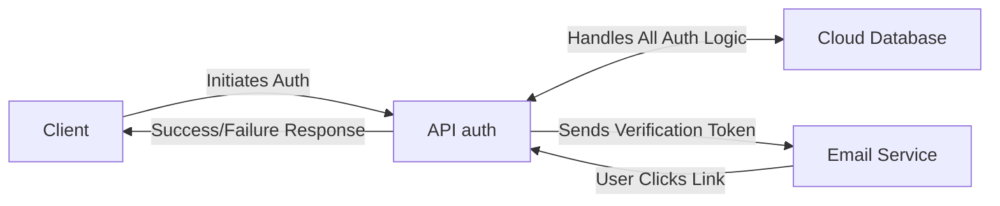

# Auth API with JWT

This project provides a basic authentication API built with Spring Boot, designed to handle user registration and login for external applications. It uses JWT (JSON Web Tokens) for session management after successful login.

## Features

*   User registration with email verification.
*   Secure password hashing using Spring Security.
*   User login with email and password.
*   JWT generation upon successful login.
*   Interaction with a PostgreSQL database.

## Technologies Used

*   Java 21
*   Spring Boot 3.4.4
*   Spring Security
*   Spring Data JPA
*   Spring Mail Sender
*   PostgreSQL
*   JJwt (Java JWT library)
*   Maven

## Database Schema

The API interacts with a PostgreSQL database (`todo` schema) containing the following tables:

```sql
CREATE TABLE IF NOT EXISTS todo.users (
    user_id UUID PRIMARY KEY,
    username TEXT NOT NULL,
    email TEXT NOT NULL,
    password_hash TEXT NOT NULL,
    created_at TIMESTAMPTZ NOT NULL,
    deleted_at TIMESTAMPTZ,
    UNIQUE (email, username)
);

CREATE TABLE todo.pending_users (
    pending_id UUID PRIMARY KEY,
    username TEXT UNIQUE NOT NULL,
    email TEXT UNIQUE NOT NULL,
    password_hash TEXT NOT NULL,
    created_at TIMESTAMPTZ NOT NULL,
    verification_code TEXT NOT NULL
);
```

## Authentication Flow



### 1. Registration

1.  **Initiate Registration:** The client application sends a POST request to `/api/auth/register` with the user's desired username, email, and password.
2.  **API Validation:** The API validates the input (e.g., checks if email/username already exists in `users` or `pending_users`).
3.  **Password Hashing:** The user's password is securely hashed using Spring Security's `PasswordEncoder`.
4.  **Verification Code:** A unique verification code is generated.
5.  **Store Pending User:** A new record is created in the `pending_users` table with the user's details, hashed password, and verification code.
6.  **Send Verification Email:** An email containing a verification link (e.g., `/api/auth/verify?code=<code>`) is sent to the user's email address.
7.  **User Verification:** The user clicks the verification link in the email.
8.  **API Verification:** The API receives the GET request to `/api/auth/verify`. It looks up the `PendingUser` using the provided code.
9.  **Activate User:** If the code is valid, the API creates a new `User` record in the `users` table using the details from the `PendingUser` record.
10. **Cleanup:** The corresponding record is deleted from the `pending_users` table.
11. **Confirmation:** The API returns a success response to the user (e.g., redirects to a confirmation page or shows a success message).

### 2. Login

1.  **Initiate Login:** The client application sends a POST request to `/api/auth/login` with the user's email and password.
2.  **Spring Security Authentication:** Spring Security intercepts the request.
    *   It uses a configured `UserDetailsService` to load the user's data (including the password hash) from the `users` table based on the provided email.
    *   It uses the `PasswordEncoder` to compare the hash of the submitted password with the stored hash.
3.  **Authentication Result:**
    *   **Success:** If the credentials are valid, the API generates a JWT containing user claims (e.g., user ID, email, roles) and an expiration time.
    *   **Failure:** If the credentials are invalid, Spring Security returns an appropriate error response (e.g., 401 Unauthorized).
4.  **Return Response:**
    *   On success, the API returns the generated JWT to the client application.
    *   On failure, the API returns the error response.

## API Endpoints

*   `POST /api/auth/register`: Register a new user.
*   `GET /api/auth/verify`: Verify a user's email address using the code from the verification email.
*   `POST /api/auth/login`: Authenticate a user and receive a JWT.

## Example Requests and Responses

#### POST /api/auth/register
- Request Body:
```json
{
  "username": "johndoe",
  "email": "john@example.com",
  "password": "P@ssw0rd!"
}
```
- Success Response (200):
```json
"Registration successful. Please check your email for verification link."
```
- Error Response (400):
```json
"Email already in use"
```

#### GET /api/auth/verify?code={verificationCode}
- Success Response (200):
```json
"Account verified successfully!"
```
- Error Response (400):
```json
"Invalid or expired verification code"
```

#### POST /api/auth/login
- Request Body (use Email OR Username):
```json
{
  "email": "john@example.com",
  "username": "",
  "password": "P@ssw0rd!"
}
```
- Alternatively, login by username:
```json
{
  "email": "",
  "username": "johndoe",
  "password": "P@ssw0rd!"
}
```
- Success Response (200):
```json
{
  "token": "eyJhbGciOiJIUzI1NiIsInR...",
  "userId": "123e4567-e89b-12d3-a456-426614174000"
}
```
- Error Response (401):
```json
"Invalid credentials"
```

## Setup

1.  **Database:** Ensure you have a running PostgreSQL instance and run the provided SQL scripts.
2.  **Configuration:** Update the `src/main/resources/application.properties` file with your PostgreSQL database connection details (URL, username, password) and your email server settings (host, port, username, password).

   ```properties
   # Database Configuration
   spring.datasource.url=jdbc:postgresql://localhost:5432/your_db_name?currentSchema=todo
   spring.datasource.username=your_db_user
   spring.datasource.password=your_db_password
   spring.jpa.hibernate.ddl-auto=validate # Or update/none as needed

   # Email Configuration
   spring.mail.host=your_smtp_host
   spring.mail.port=587 # Or your port
   spring.mail.username=your_email_username
   spring.mail.password=your_email_password
   spring.mail.properties.mail.smtp.auth=true
   spring.mail.properties.mail.smtp.starttls.enable=true
   ```

3.  **Run:** Execute the application using Maven:
    ```bash
    mvn spring-boot:run
    ```
