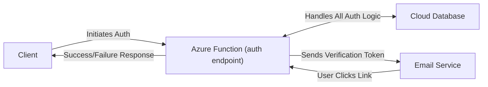

# Serverless Auth API with JWT (Azure Functions)

This project provides a basic authentication API built with Azure Functions and the Spring Framework, designed to handle user registration and login for external applications. It uses JWT (JSON Web Tokens) for session management after successful login.

## Features

*   User registration with email verification.
*   Secure password hashing using Spring Security.
*   User login with email and password.
*   JWT generation upon successful login.
*   Interaction with a PostgreSQL database.

## Technologies Used

*   Java 21
*   Azure Functions
*   Spring Framework (leveraged within Azure Functions)
*   Spring Security
*   Spring Data JPA
*   Java Mail Sender
*   PostgreSQL
*   JJwt
*   Maven

## Database Schema

The API interacts with a Neon PostgreSQL database (`todo` schema) containing the following tables:

```sql
CREATE TABLE IF NOT EXISTS todo.users (
    user_id UUID PRIMARY KEY,
    username TEXT NOT NULL,
    email TEXT NOT NULL,
    password_hash TEXT NOT NULL,
    created_at TIMESTAMPTZ NOT NULL,
    deleted_at TIMESTAMPTZ,
    UNIQUE (email, username)
);

CREATE TABLE todo.pending_users (
    pending_id UUID PRIMARY KEY,
    username TEXT UNIQUE NOT NULL,
    email TEXT UNIQUE NOT NULL,
    password_hash TEXT NOT NULL,
    created_at TIMESTAMPTZ NOT NULL,
    verification_code TEXT NOT NULL
);
```

## Authentication Flow



### 1. Registration

1.  **Initiate Registration:** The client application sends a POST request to `/api/auth/register` with the user's desired username, email, and password.
2.  **API Validation:** The API validates the input (e.g., checks if email/username already exists in `users` or `pending_users`).
3.  **Password Hashing:** The user's password is securely hashed using Spring Security's `PasswordEncoder`.
4.  **Verification Code:** A unique verification code is generated.
5.  **Store Pending User:** A new record is created in the `pending_users` table with the user's details, hashed password, and verification code.
6.  **Send Verification Email:** An email containing a verification link (e.g., `/api/auth/verify?code=<code>`) is sent to the user's email address.
7.  **User Verification:** The user clicks the verification link in the email.
8.  **API Verification:** The API receives the GET request to `/api/auth/verify`. It looks up the `PendingUser` using the provided code.
9.  **Activate User:** If the code is valid, the API creates a new `User` record in the `users` table using the details from the `PendingUser` record.
10. **Cleanup:** The corresponding record is deleted from the `pending_users` table.
11. **Confirmation:** The API returns a success response to the user (e.g., redirects to a confirmation page or shows a success message).

### 2. Login

1.  **Initiate Login:** The client application sends a POST request to `/api/auth/login` with the user's email and password.
2.  **Spring Security Authentication:** Spring Security intercepts the request.
    *   It uses a configured `UserDetailsService` to load the user's data (including the password hash) from the `users` table based on the provided email.
    *   It uses the `PasswordEncoder` to compare the hash of the submitted password with the stored hash.
3.  **Authentication Result:**
    *   **Success:** If the credentials are valid, the API generates a JWT containing user claims (e.g., user ID, email, roles) and an expiration time.
    *   **Failure:** If the credentials are invalid, Spring Security returns an appropriate error response (e.g., 401 Unauthorized).
4.  **Return Response:**
    *   On success, the API returns the generated JWT to the client application.
    *   On failure, the API returns the error response.

## API Endpoints

The following Azure Function HTTP Triggers are exposed (assuming a default route prefix of `api`):

*   `POST /api/auth/register`: Register a new user.
*   `GET /api/auth/verify`: Verify a user's email address using the code from the verification email.
*   `POST /api/auth/login`: Authenticate a user and receive a JWT.

## Example Requests and Responses

#### POST /api/auth/register
- Request Body:
```json
{
  "username": "johndoe",
  "email": "john@example.com",
  "password": "P@ssw0rd!"
}
```
- Success Response (200 - Email Sent, Verification Code Returned):
```text
Registration successful. Verification code: <actual-verification-code>
```
- Error Response (400 - e.g., duplicate email/username):
```json
{
  "code": "BAD_REQUEST",
  "message": "Email already in use"
}
```

#### GET /api/auth/verify?code={verificationCode}
- Success Response (200):
```text
User verified successfully. You can now log in.
```
- Error Response (400 - Invalid Code / 410 - Expired Code):
```text
Invalid or expired verification code.
```

#### POST /api/auth/login
- Request Body (use Email OR Username):
```json
{
  "email": "john@example.com",
  "username": "",
  "password": "P@ssw0rd!"
}
```
- Alternatively, login by username:
```json
{
  "email": "",
  "username": "johndoe",
  "password": "P@ssw0rd!"
}
```
- Success Response (200):
```json
{
  "token": "eyJhbGciOiJIUzI1NiIsInR...",
  "userId": "123e4567-e89b-12d3-a456-426614174000"
}
```
- Error Response (401):
```json
"Invalid credentials"
```

## Setup

1.  **Database:** Ensure you have a running PostgreSQL instance and run the provided SQL scripts from the `Database Schema` section.
2.  **Configuration:**
    *   **`src/main/resources/application.properties`**: Set the environment variables for the values on this file with your PostgreSQL database connection details and your email server settings. These properties are used by the Spring context within the Azure Functions.
    
3.  **Run Locally:**
    Execute the application using the Azure Functions Maven plugin:
    ```bash
    mvn clean package azure-functions:run
    ```
    The functions will typically be available at `http://localhost:7071/api/...`.

4.  **Deploy to Azure:**
    You can deploy the functions to Azure using several methods:
    *   **Azure Functions Maven Plugin:**
        ```bash
        mvn azure-functions:deploy
        ```
        (Requires configuration in your `pom.xml` for the Azure Function App details).
    *   **Azure CLI**
    *   **VS Code Azure Functions Extension**
    *   **Azure Portal**
